# 向量

如果你是一个普通的开发者，线性代数应该是一个你不太熟悉的领域，因为我们更习惯于用计算机解决逻辑问题，它们是离散的，而线性代数则关注的是在连续空间中的计算问题。但就如同你已经感受到的一样，如果你想让自己在deep learning有所作为，线性代数又是一个必须要点出来的天赋。

因此，在这个系列里，我们就围绕着**理解深度学习所必需掌握的线性代数知识**这个准则，给大家装备必要的知识点。当然，我们的目的并不是成为数学家，也不是为了通过期末考试，我们的重点是理解那些成行成列的数据究竟在表达什么含义、它们的计算究竟在解决哪些现实问题。因此，别担心，绝大多数时候，我们都会用最浅显易懂的方式，来展示线性代数概念的本质含义。

> 作为一门数学，有时，你还是要慢下来自己在纸上写写算算才能真的理解其中的含义。

## 从标量开始

作为开始，第一个要介绍的概念叫做标量（Scalars）。简单来说，标量在形式上就是一个数字，这是线性代数中唯一一个只用单个数字表示的概念。提到标量的时候，通常用一个斜体小写字母表示。和一般数字不同的是，提起标量，通常我们要说明这个数字表示的具体含义。例如：平面空间中所有直线的斜率*s*，就是在实数范围**R**中的一个标量，只提及数值而没有含义的数字是不能称作标量的。

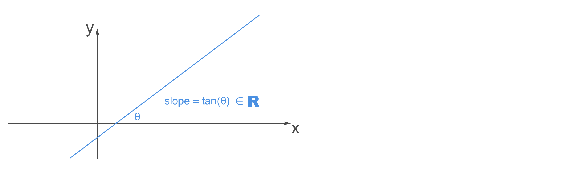

## 向量是“向”和“量”的组合

### 从印象里的坐标开始

但有时，只靠单个数字不足以完整表示现实中的事物。一个最熟悉的例子，就是平面中的点，它需要两个值*x*和*y*，分别表示在其在X轴和Y轴的位置：

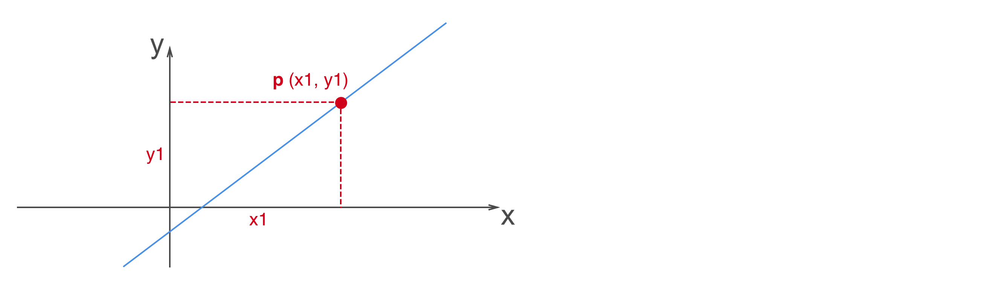

因此，形象的说，当我们把多个数字作为一个整体放在一起时，就定义了一个向量（Vector）。只不过，在线性代数里，向量通常是竖着写的，也叫做**列向量**，或者，我们在**行向量**的右上角写一个字母T，表示一个列向量：

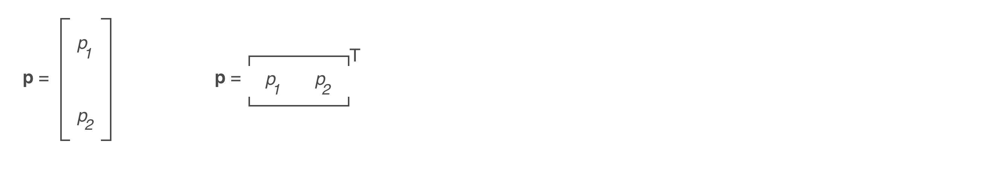

在上面这张图里可以看到，通常我们用一个加粗的小写字母表示一个向量，例如**p**，而用和向量同名的普通斜体小写字母搭配上对应位置的下标，表示向量中的单个元素，例如：*p1*，*p2*了。

> 你可能会觉得很奇怪，为什么向量一定要竖着写呢？这看着很别扭啊，这里说一个“不算理由的理由”：当通过一个矩阵**M**，对一个向量**v**进行变换的时候，通常会记做：**M****x**，如果此时**x**是一个行向量，为了得到同样的结果就必须要写成**x****M**，这是完全不符合习惯的做法。当然，如果你还不了解矩阵也没关系，后面我们会提到这个概念。

### 向量支持的算术运算

再进一步深入之前，我们来看向量支持的两种常用的运算，它们分别是：向量加法运算和数量乘法运算。**向量加法**运算很简单，相同“规模”的两个向量对应位置的元素直接相加就好了，例如：

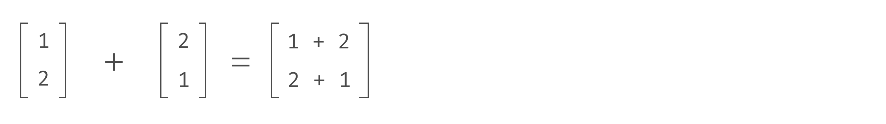

它的含义，就是顺序沿着两个向量的方向最终走到的新的位置：

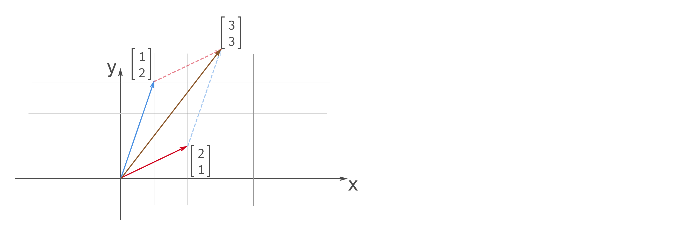

从图中可以看到，无论我们先从蓝色，还是先从红色的路线出发，最终到达的位置是一样的，因此，向量的加法和普通数字的加法一样，也支持交换律。即：

- **x** + **y** = **y** + **x**
- **x** + (**y** + **z**) = (**x** + **y**) + **x**

接下来，是向量的**数量乘法**，只要把向量中的每一个元素都和数字相乘就好了，例如：

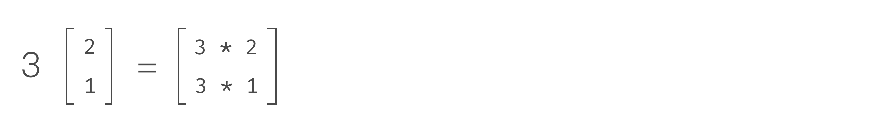

通常，向量的数量乘法中，数字和向量之间一般不写乘号。通过下面这个图我们就能明白，向量的数量乘法表示把向量放大特定的倍数：

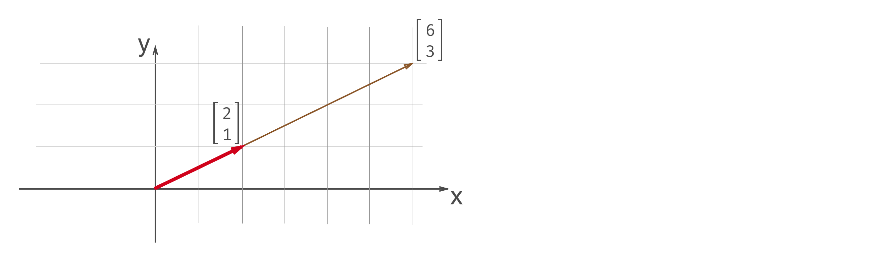

理解了这个性质之后，就不难记住，向量的数量乘法支持下面的性质：

- (*c* + *c'*)**x** = *c***x** + *c'***x**
- *c*(**x** + **y**) = *c***x** + *c***y**
- (*cc'*)**x** = *c*(*c'***x**)

> 如果这是你第一次接触这个概念，那么现在应该停下来，在纸上把上面这些运算表示的含义画一下，就能理解为什么它们相等了。

最后再补充一个特殊的向量，叫做**零向量**，也就是所有元素都是0的向量，这种向量统一用***o\***来表示，但你要记住，零向量并不是一个单一的数字0，它也是一个向量。

### 理解向量空间

在上面我们解释向量的所有例子里，都使用了笛卡尔坐标系，尽管这种方式最容易理解，但却也最容易造成误会，让我们觉得向量就是在平面直角坐标系中的点。实际上并不如此，向量，就是单纯的方向和量的组合，因此，我们完全可以去掉任何坐标系，此时的向量仍旧可以表达它自身的含义：

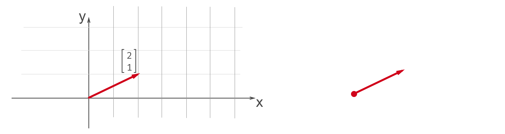

就像图中所示的这样，右侧的红色向量同样可以表示从向量的起点至向量的终点移动的方向和长度。而此时，向量加法和数量乘法的定义，仍旧是有效的：

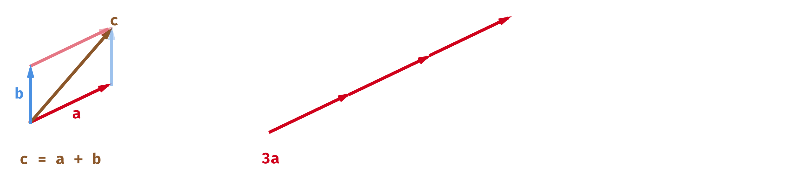

我们管这样单纯由向量定义的空间叫做线性空间，也叫做向量空间。在这种空间里的向量，也叫做有向线段，它们是在空间中用来度量的唯一准则。

### 什么是向量的基底？

尽管向量可以脱离坐标系存在，但是，在一个向量空间里，描述位置和大小都很不方便，除了用手比划，我们就没有更好的方式了。并且，我们也无法比较方向不同的两个向量，无法对向量进行旋转。因此，尽管笛卡尔坐标不是度量向量的唯一方式，但我们还是需要一个衡量向量的基准。例如，像下图这样：

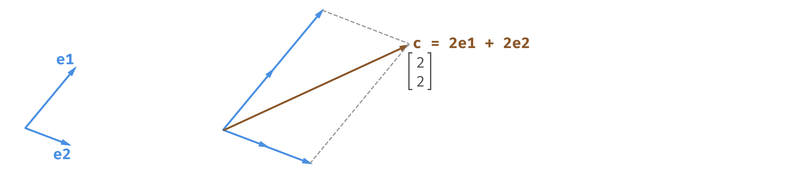

我们假设用**e1**和**e2**形成的坐标系表示一个平面的单位度量，那么向量**c**就可以表示成：“2个**e1**那么长的向量加上2个**e2**这么长的向量”。在**e1e2**形成的坐标系里，向量**c**的坐标就是(2, 2)T。

于是，我们管坐标系中**e1e2**形成的这组向量就叫做**基底**，其中的**e1**和**e2**叫做**基向量**，而沿着基向量可以到达的每一个位置，就是在基底定义的空间中的坐标。

把这个概念再用到一开始的笛卡尔坐标系，我们选取的**e1**和**e2**，只不过就是互相垂直，长度为1的基向量罢了：

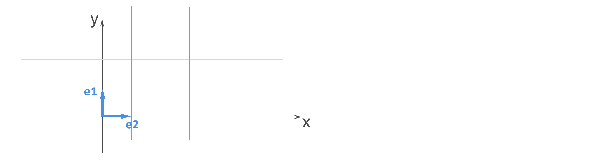

### 什么是向量的线性组合？

通过前面对基底的讨论，你可能会发现，描述一个向量的基底并不唯一，就像下面这个例子：

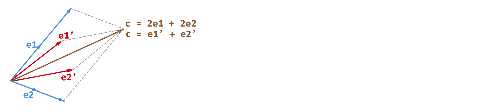

在**e1e2**这个空间中，**c**的坐标是(2, 2)T，但是，在**e1'e2'**这个空间中，**c**的坐标就变成了(1, 1)T。

但是，所有的基底都应该同时满足下面两个条件：

- 可以表示当前向量空间中的任何一个向量；
- 任何一个向量的表示方法都是唯一的；

说具体一些，就是二维平面里，我们只需要两个基向量定义基底；如果再多一个基向量，就会存在同一个向量可以由其中任意两个基向量表示的情况，唯一性就打破了（如果你想不明白，就自己画一下，和我们上面那个图是类似的）。

那么，把上面这段话进一步抽象下：对于一个由(**e1**, **e2**, ..., **en**)形成的向量组合来说，对于空间中任意一个向量**v**，都可以用*u1***e1** + *u2***e2** + ... + *un***en**来**唯一**表示的话，(**e1**, **e2**, ..., **en**)就叫做基底，并且，*u1***e1** + *u2***e2** + ... + *un***en**这样的形式，就叫做基底的**线性组合**。

并且，描述一个向量所需要的基底的个数，就叫做这个向量的**维数**。

## What's next?

以上，就是关于向量的全部内容。我们介绍了向量的定义，计算以及空间表示方法。真正理解它们，是继续探索线性代数领域的基础，因此，如果这些概念还没在你头脑里留下深刻的印象，那么你不妨基于二维空间去画一画这些基本概念，然后尝试给自己讲清楚。在下一节，我们就开始介绍一个更复杂的计算工具——矩阵。
